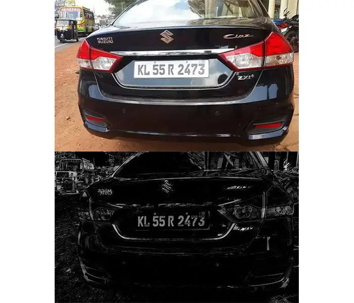
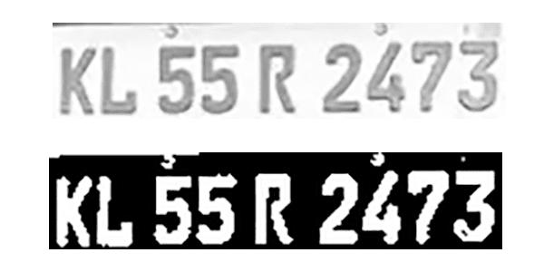

# Lincese Plate Detection

Detect and extract images and information from images using openCV and Tesseract OCR

Based on [OpenCV: Automatic License/Number Plate Recognition (ANPR) with Python](https://pyimagesearch.com/2020/09/21/opencv-automatic-license-number-plate-recognition-anpr-with-python/) by Adrian Rosebrock on September 21, 2020

## Prerequisites
The project code utilizes the following library:
- [Python](https://www.python.org/) v3.8.6
- [OpenCV](https://opencv.org/) v4.4.0.46
- [imutils](https://github.com/jrosebr1/imutils) v0.5.3
- [scikit-image](https://scikit-image.org/) v0.17.2
- [pytesseract](https://github.com/madmaze/pytesseract) v0.3.6
- [Tesseract-OCR](https://tesseract-ocr.github.io/tessdoc/) v5.0.0 (alpha). (installed with Windows installer)

## Explanation
Image containing a car license plat is processed using OpenCV to start an Image processing Pipeline that changes the image into something that can be read and proccesed. For example one might start an Image Processing Pipeline, by applying a color mask to remove all unnecessary colors.   

    
     

Example of image processing, all colors are remove except the important parts

 
  
This proccesed used a variaty of image processing technique like Gaussian Blur to further extract information from an image. in the example of Gaussian Blur, it is one of the technique to increase the clarity of an image or to sharpen the image.    
  
After further process we can get a black and white image of the license plate with little impurities.  
  

    
     

Example of image result of Image Processing Pipeline

 
  
Using Tesseract OCR, an optical character recognition engine for various operating systems, we can extract information from the clear image of license plate we extracted. If the image doesnt extract any information that means that either there is no license plate or there is still imperfections in the image processing pipeline.
  
And so we can Detect License Plate

## Credits and Lincense:
[OpenCV: Automatic License/Number Plate Recognition (ANPR) with Python](https://pyimagesearch.com/2020/09/21/opencv-automatic-license-number-plate-recognition-anpr-with-python/) by Adrian Rosebrock on September 21, 2020  
Copyright (c) for portions of project "License Plate Detection with OpenCV" are held by [Adrian Rosebrock (http://www.pyimagesearch.com), 2015 - 2016]  as part of project "imutils"  
